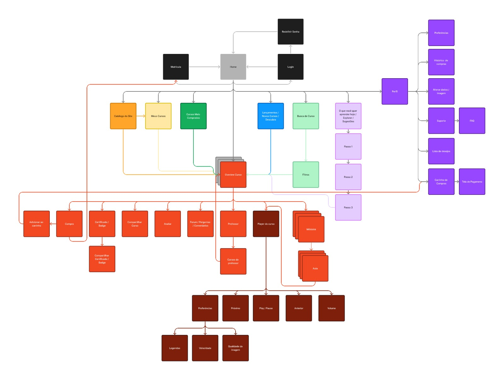

## Pra Quem Faz - Plataforma de Cursos Livres

**Visão Geral**

Pra Quem Faz (PQF) é uma plataforma de cursos livres oferecida pela UNISUAM. Anteriormente, o PQF funcionava como um agregador de links para o Hotmart, onde todo o processo de compra e consumo de conteúdo era feito externamente. Nosso projeto visa transformar o PQF em uma plataforma completa, onde toda a jornada do aluno ocorre dentro do próprio site, desde a compra até o acesso ao conteúdo dos cursos.

Essa migração para uma arquitetura moderna com Next.js no frontend e tecnologias escaláveis no backend traz melhorias significativas em termos de experiência do usuário, fortalecimento da marca, segurança, escalabilidade e redução de custos a longo prazo.


### Tela Inicial
<p align="center">
  
</p>


### Fluxograma do Aplicativo



## Tecnologias Utilizadas

**Next.js**: Framework React para renderização no lado do servidor e otimização de SEO.

## Iniciando o projeto

Primeiro, instale as dependências:

```bash
npm i
# or
yarn install
```

Segundo, rode o servidor de desenvolvimento:

```bash
npm run dev
# or
yarn dev

```

Open [http://localhost:3000](http://localhost:3000) with your browser to see the result.

## Contribuindo com o Projeto!

Contribuições são bem-vindas! Sinta-se à vontade para abrir issues ou pull requests.

### Git e Controle de Versão

Antes de adicionar código ao projeto, é importante seguir algumas diretrizes de controle de versão utilizando Git.

1. **Verificar Branch Atual:**
Verifique em qual branch você está trabalhando usando o comando:
```sh
git branch
```
Nunca faça commits diretamente na branch `main`.

2. **Criar uma Nova Branch:**
#### Ao criar uma nova página ou recurso, crie uma nova branch com um nome significativo:
```sh
git checkout -b feature/NomeDaFeature
```

#### Para correções, utilize:
```sh
git checkout -b fix/NomeDaCorrecao
```

3. **Comandos Úteis:**
- **git pull:** Atualiza o repositório local com as atualizações mais recentes do repositório remoto.
- **git push:** Envie suas alterações locais para o repositório remoto.
- **git stash:** Guarde temporariamente suas mudanças não concluídas para aplicar posteriormente.
- **git commit -m "mensagem":** Commita suas mudanças com uma mensagem descritiva.

Exemplo de uso do `git commit`:
```sh
git add .
git commit -m "Adiciona funcionalidade X"
git push origin feature/NomeDaFeature
```
